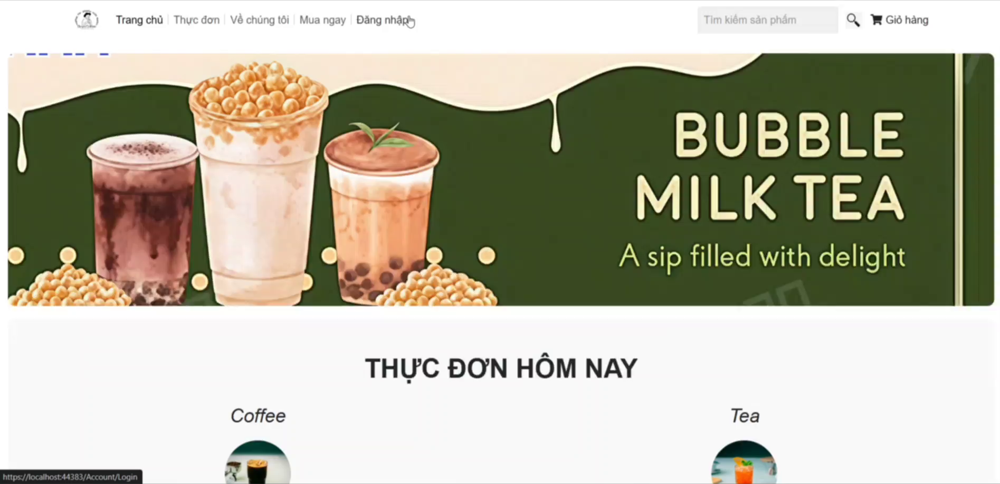
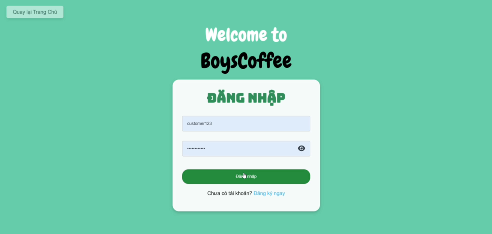
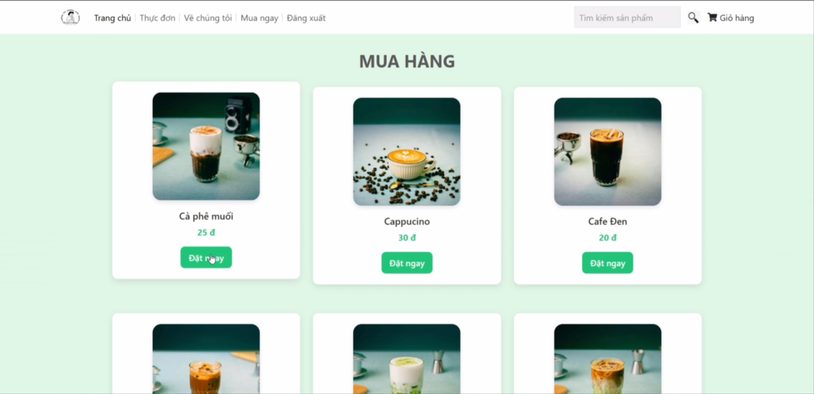

# Coffe Store Dotnet (Boys Cofffe)

BoysCoffee is a web application designed to provide a convenient platform for customers to browse, select, and order beverages from anywhere. Beyond serving as an online shopping tool, BoysCoffee equips administrators with a powerful system for managing customer information, orders, and products, enabling effective business growth strategies.

---

## Project Overview

### UI
We lost some data so we only have old and broken images.
### Home page

### Login page

### Menu page

### Team Members and Role
- **Đinh Trung Kiên** (Fullstack) - [k1enn](https://github.com/k1enn)
- **Trương Gia Lâm** (Frontend) - [LamaTrw](https://github.com/LamaTrw)
- **Mai Đông Anh** (UI/UX Design, Frontend) - [bebaobanhbao](https://github.com/bebaobanhbao)
- **Dương Nguyễn Gia Khang** (Frontend) - [Naga-OS](https://github.com/Naga-OS)

### Features
1. **Customer-Facing Features:**
   - **Homepage:** Showcase products and categories.
   - **User Management:** Allow customers to register and log in to their accounts.
   - **Product Browsing:** View detailed information about beverages.
   - **Shopping Cart:** Add, update, and review items for purchase.
   - **Order Placement:** Enable customers to place online orders.

2. **Admin-Facing Features:**
   - **User Management:** Manage customer accounts.
   - **Order Management:** View and manage customer orders.
   - **Product Management:** Add, edit, or delete beverages from the catalog.

---

### Achievements
- Built a simple and functional e-commerce website for beverages.
- Implemented secure online account registration and login functionality.
- Developed an admin management system for users, products, and orders.
- Applied LINQ and C# for efficient backend operations.
- Designed and managed the database using Entity Framework with Code-First approach.
- Gained experience in collaborative development and database management.

---

## Technologies Used
- **Framework:** ASP.NET Framework
- **ORM:** Entity Framework (Code First)
- **Language:** C#
- **Database:** In-memory database
- **Frontend:** Razor Views, HTML, CSS, JavaScript
- **Backend:** LINQ and Entity Framework
- **Version Control:** Git

---

## Future Development
1. Add online payment functionality.
2. Integrate home delivery and shipping options.
3. Enhance the UI/UX with custom banners and product images.
4. Introduce discount and promotional features.
5. Develop a profile page for customers to view order history.
6. Expand cart functionality with additional user-friendly features.

---

## References
- **Learning Resources:**
  - YouTube
  - Google
  - ChatGPT
- **Inspirational Websites:**
  - [The Coffee House](https://thecoffeehouse.com/)
  - [Highlands Coffee](https://www.highlandscoffee.com.vn/)
  - [Phúc Long](https://phuclong.com.vn/)

---

This project not only serves as a practical application of ASP.NET and Entity Framework but also demonstrates teamwork, database handling, and full-stack development skills.
